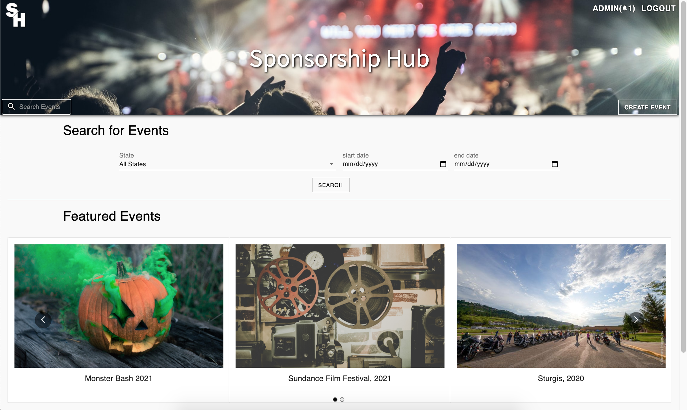
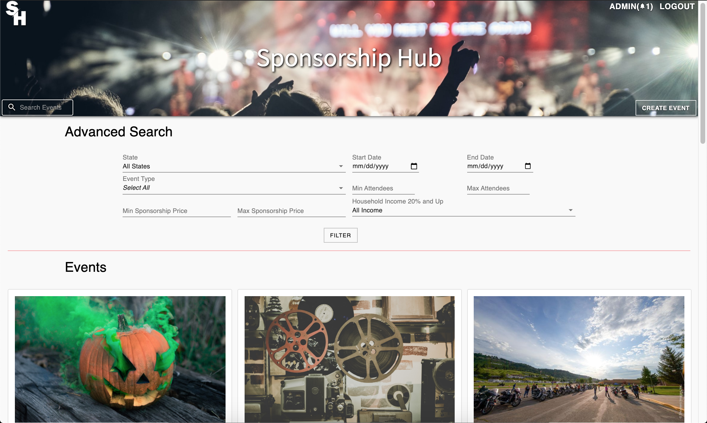
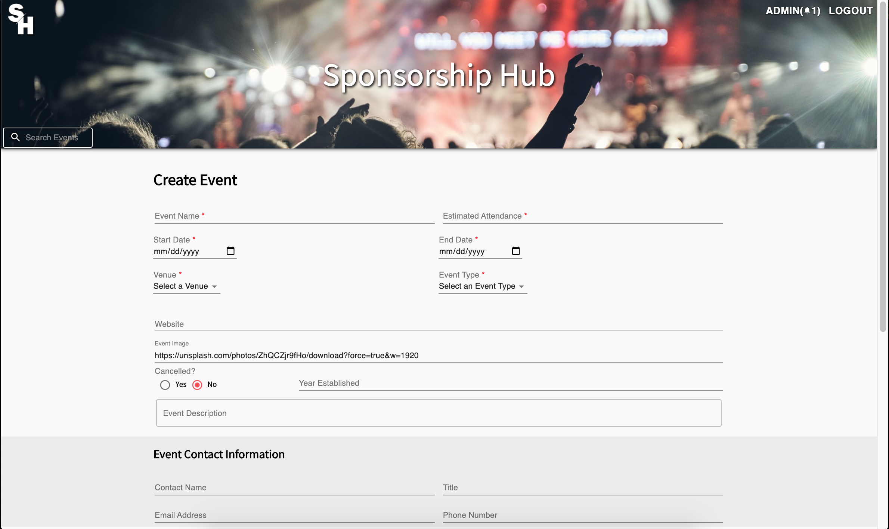

# Sponsorship Hub

## Description

Duration: 2 week sprint

Sponsorship Hub is an web application that stores data from events such as festivals and gives brands interested in sponsoring those events the ability to search for the perfect fit using filters. Users may also create and edit events as desired which specific access that can be granted from the Admin. Sponsorship Hub stores collected data to reduce repetitive work for the researchers and connects brands with events quicker and easier.

To see the fully functional site, please visit: [WEBSITEURL](WEBSITEURL)

## Screen Shots of Sponsorship Hub

Here are some screen shots of Sponsorship Hub

**Landing Page**

**Advanced Search**

**Event Page View**

**Create Event**

**Edit Page**

## Prerequisites

Software required to install this application are as listed:

* [Node.js](https://nodejs.org/en/)

## Installation

1.) 

