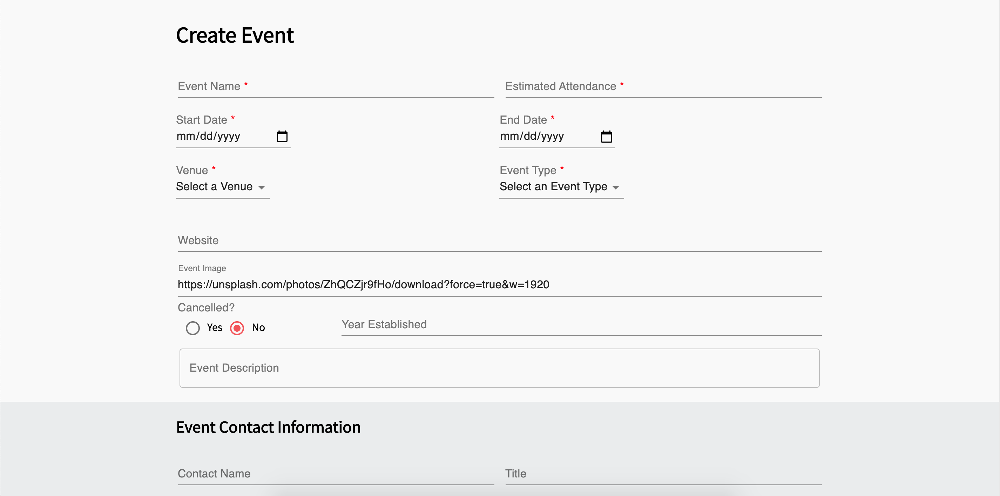

# Sponsorship Hub

## Description

Duration: 2 week sprint

Sponsorship Hub is an web application that stores data from events such as festivals and gives brands interested in sponsoring those events the ability to search for the perfect fit using filters. Users may also create and edit events as desired which specific access that can be granted from the Admin. Sponsorship Hub stores collected data to reduce repetitive work for the researchers and connects brands with events quicker and easier.

To see the fully functional site, please visit: [WEBSITEURL](WEBSITEURL)

## Screen Shots of Sponsorship Hub

Here are some screen shots of Sponsorship Hub

**Landing Page**


**Advanced Search**


**Event Page View**


**Create Event**



**Edit Page**


## Prerequisites

Software required to install this application are as listed:

* [Node.js](https://nodejs.org/en/)

## Installation

1.) Create a database named ```sponsorship_hub``` and run the queries from our [database.sql](https://github.com/SponsorshipHub/sponsorship-hub/blob/master/database.sql)

2.) The queries inside of ```[database.sql](https://github.com/SponsorshipHub/sponsorship-hub/blob/master/database.sql) ``` file are set to create the necessary tables to populate the needed data for this application to run correctly. This project is built on ```[Postgres](https://www.postgresql.org/)```, so you will need to make sure to have that installed. We recommend using ```[Postico](https://eggerapps.at/postico/)``` to run those queries as they were originally created there.

3.) Open your source code editor and run ```npm install```

3.) Create a .env file and set up SERVER_SESSION_SECRET=```superDuperSecretKey``` where ```superDuperSecretKey``` is your generated password. You can randomly generate a password here at [password generator](https://passwordsgenerator.net/).  If you don't do this step, create a secret with less than eight characters, you will get a warning. The secret value can be any random string of characters.

5.) To allow emails to be generated for the new user and the admin upon user registration, you will have to set up a API key for ```[Sendgrid](https://sendgrid.com/).``` Please set up an account with ```[Sendgrid](https://sendgrid.com/).``` and follow these ```[instructions](https://sendgrid.com/docs/ui/account-and-settings/api-keys/)```. Once you have created your API KEY, inside the .env file set up ```SENDGRID_API_KEY=yourSendgridApiKey```.

4.) Run ```npm run server``` in your terminal

5.) Run ```npm run client``` in your terminal which will open up a new browser tap to view the application

